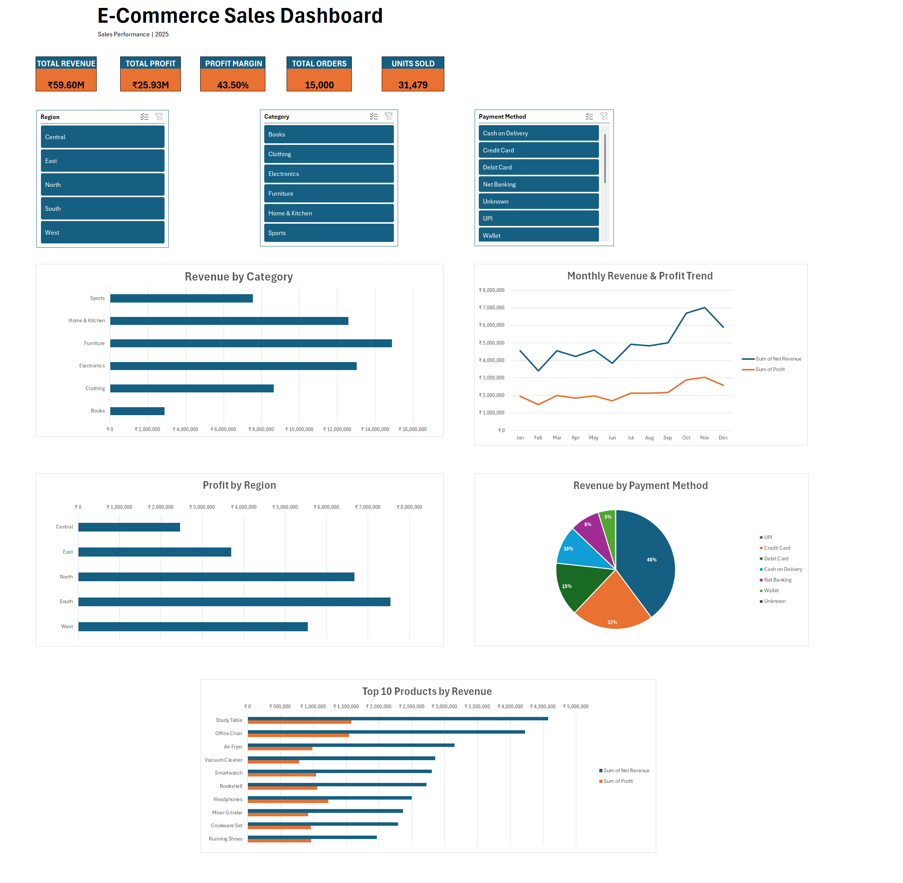

# AI-Powered E-Commerce Business Analysis

## Project Overview

An end-to-end e-commerce business analysis project built using Microsoft Excel, PivotTables, an interactive dashboard, and AI-assisted analysis.

The project analyzes 15,000 orders and 31,479 units to evaluate revenue, profit, and profitability across product categories, regions, months, products, and payment methods.

## Business Objective

The objective of this project is to identify key business performance drivers, understand profitability patterns, and translate data findings into actionable business recommendations.

## Tools & Technologies

- Microsoft Excel
- Excel PivotTables
- Excel Dashboard
- Data Analysis
- Data Visualization
- AI-Assisted Business Analysis

## Key Performance Indicators

| KPI           |         Value  |
|---------------|---------------:|
| Total Orders          | 15,000 |
| Units Sold            | 31,479 |
| Total Revenue         | ₹59.60M|
| Total Profit          | ₹25.93M|
| Overall Profit Margin | 43.50% |

## Analysis Performed

### Category Analysis
Analyzed revenue, profit, and profit margins across six product categories to identify the strongest revenue and profitability contributors.

### Regional Analysis
Compared revenue, profit, and profit margins across Central, East, North, South, and West regions.

### Monthly Analysis
Analyzed monthly revenue and profit trends to identify seasonal patterns and periods of stronger business performance.

### Product Analysis
Evaluated the Top 10 products based on revenue, profit, and profit margin to identify high-volume and high-margin products.

### Payment Method Analysis
Compared revenue, profit, and profitability across UPI, Credit Card, Debit Card, Cash on Delivery, Net Banking, Wallet, and Unknown payment classifications.

## Dashboard

The Excel dashboard provides an interactive view of overall business performance using KPIs, charts, filters, and PivotTable-based analysis.

## Key Insights

- Furniture is the largest revenue-generating category.
- Electronics generates the highest absolute profit among categories.
- Books has the highest profit margin at 56.42%.
- South is the strongest region by revenue and absolute profit.
- November is the strongest month by revenue and profit.
- Study Table is the strongest revenue and profit driver among the Top 10 products.
- Headphones and Running Shoes have the highest profit margins among the Top 10 products.
- UPI is the dominant payment method by revenue and profit.
- Unknown payment classifications represent a small portion of revenue but have a lower margin than known payment methods.

## AI-Assisted Analysis

AI was used after the Excel-based analysis to help interpret verified analytical results, identify business patterns, and formulate actionable recommendations.

The underlying calculations and PivotTable analysis were performed in Excel. AI was used as an analytical support tool rather than as a replacement for the underlying data analysis.

## Business Recommendations

- Investigate pricing, costs, and discounts affecting lower-margin categories and products.
- Protect the performance of high-revenue categories and regions.
- Prepare inventory and operational capacity ahead of year-end demand.
- Increase sales volume for high-margin products such as Headphones and Running Shoes.
- Maintain reliable UPI and Credit Card payment availability.
- Review Unknown payment classifications for data-quality improvement.

## Project Files

- `AI_Powered_Ecommerce_Business_Analysis.xlsx` — Excel workbook containing the dataset, PivotTable analysis, dashboard, and AI analysis.
- `AI_Powered_Ecommerce_Business_Analysis_Report.pdf` — Detailed project report.
- `images/dashboard_image.png` — Dashboard preview.

## Project Outcome

This project demonstrates the use of Excel-based data analysis, business intelligence techniques, dashboard development, and AI-assisted interpretation to transform raw e-commerce data into actionable business insights.
